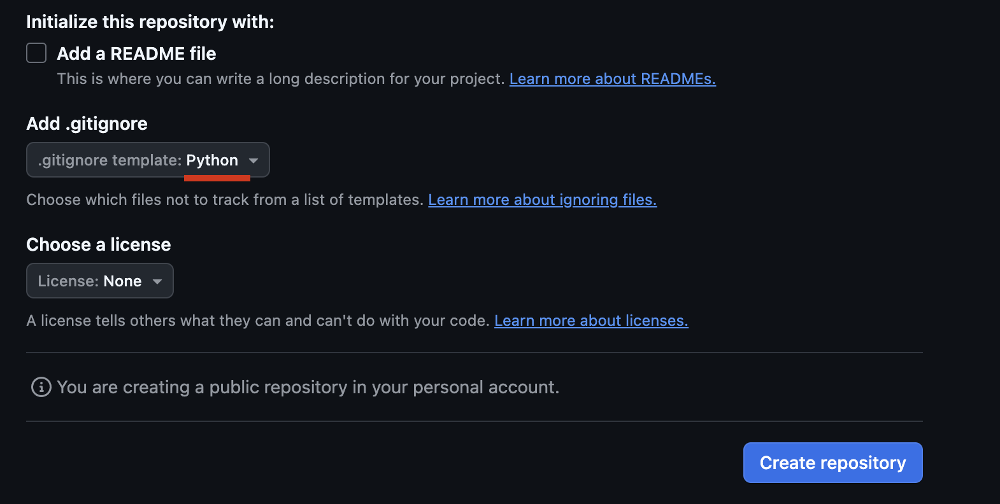
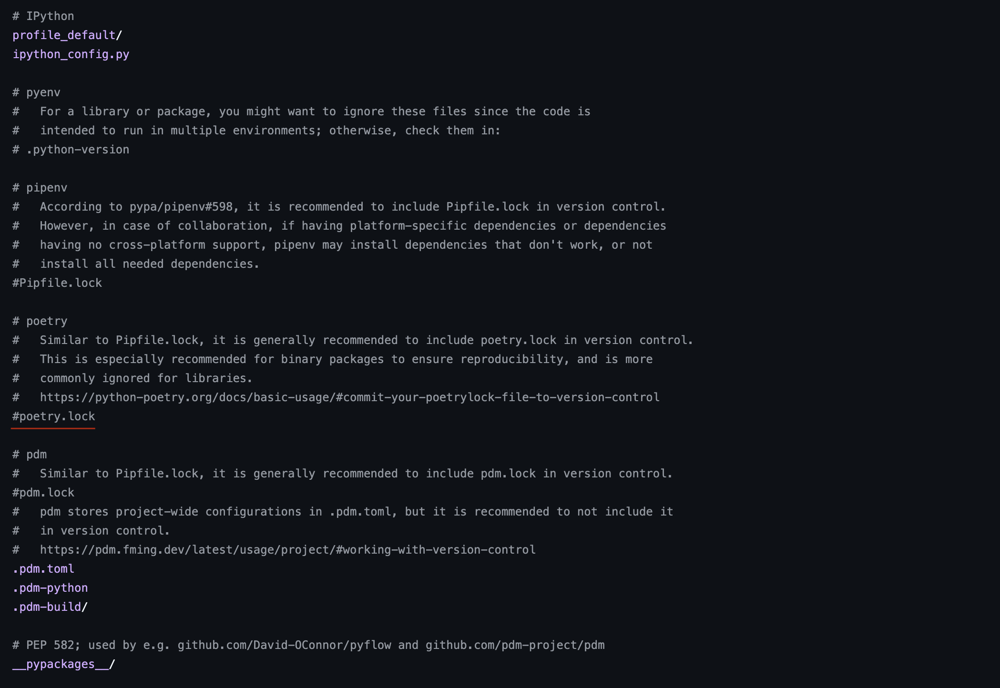
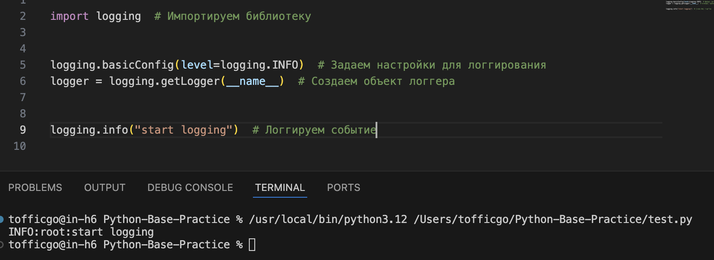

# Python-Base-Practice

> Для понимания описанных здесь вещей желательно знать питон на базовом уровне.

## Содержание:
* [Аннотации типов](#аннотации_типов)
* [Докстринги](#докстринги)
* [Автодокументирование](#автодокументирование)
* [Линтеры](#линтеры)
* [Форматтеры](#форматтеры)
* [pre-commit](#pre_commit)
* [Pydantic](#pydantic)
* [Конфиги и приватные данные](#конфиги_и_приватные_данные)
* [Виртуальные окружения](#виртуальные_окружения)
* [Файлы requirements.txt и pyproject.toml](#файлы_requirements_и_pyproject)
* [Файл .gitignore](#Файл_gitignore)
* [Протоколы](#протоколы)
* [Стили именования коммитов](#стили_именования_коммитов)
* [Git flow](#git_flow)
* [Логгирование](#logging)
* [Конструкция `if __name__ == "__main__"`](#конструкция_if_name)
* [Файл `__init__.py`](#файл__init__.py)
* [Тесты на pytest](#pytest)

<br>

<a name="аннотации_типов"></a> 

# Аннотации типов (type hints)

В питоне **типизация** является ***динамической***, что может упрощать многие аспекты разработки, но также это может привести к **непредвиденным ошибкам** и **усложнению понимания кода**. Для улучшения ситуации, в питоне есть такая вещь как ***тайп хинты***. По факту, это просто подсказки для типов переменных, выглядят они так:

```python
x: str = "hello"

def foo(y: int) -> None:
    ...
```

Но это всего лишь **подсказки**, вам ничего не помешает записать в переменную с хинтом str число или объект. При этом, я все равно настоятельно рекомендую вам их прописывать. Во многих ide на их основе, например, создаются интерактивные подсказки.

## Пример без хинта:
<image src="images/1.png">

## Пример с хинтом:
<image src="images/2.png">

***

<br>

Для переменных можно задавать сразу несколько типов с помощью | :

```python
x: int | str = "123"
y: int | str = 123
z: int | None = None
```

<br>

Для более удобной работы с хинтами в питоне есть встроенная библиотека **typing**:

```python
from typing import Any, Generator, Optional


x: Optional[int]
# то же самое что и:
# x: int | None


# Any - любой тип
def foo() -> Generator[Any]:
    yield 1
    yield "hello"
```

<br>

Вы также можете объявлять свои собственные типы:

```python
from typing import Optional, TypeVar


type Username = Optional[str]
type UserAge = Optional[int]

DataField = TypeVar("UserFields", Username, UserAge)

type UserData = dict[str, DataField]
```

<br>

Подробнее про тайпхинты можете прочитать [тут](https://habr.com/ru/companies/lamoda/articles/432656/)

<br>

<a name="докстринги"></a> 

# Докстринги (docstrings)

**Докстринги** - это специальные комментарии в коде, по которым ide создает подсказки. Прописываются они в начале функций, классов, методов и модулей.

Выглядят они так:

<image src="images/7.png">

Вот так выглядят подсказки в vs code:

<image src="images/8.png">

Вот [хорошая статья](https://realpython.com/documenting-python-code/#docstring-formats) по докстрингам и разным стилям их написания.

<a name="автодокументирование"></a> 

# Автодокументирование (Sphinx)

В экосистеме питона есть инструмент для автоматического создания документации (как Doxygen для C), называется он sphinx.

Базовый вариант документация выглядит примерно так:

<image src="images/9.jpg">

Есть и второй вариант внешнего вида:

<image src="images/10.jpg">

<br>

[Документация sphinx](https://www.sphinx-doc.org/en/master/usage/installation.html).

[Статья](https://habr.com/ru/companies/netologyru/articles/815563/) с понятным объяснением по настройке.

<a name="линтеры"></a> 

# Линтеры

Что такое линтер? **Линтер** - это всего лишь программа, которая проверяет твой код. Люди, использующие vs code наверняка знакомы с Pylance. Он проверяет синтаксис во время разработки, чтобы сразу указать на все ошибки. Но зачастую, его одного бывает недостаточно. Я выделю три самых нужных линтера по-моему мнению.

> Для их использования вам нужно будет установить соответствующий линтер через pip. <br>
> После установить плагин/расширение в вашей ide.

## flake8
Он схож с Pylance, но имеет перед ним огромное преимущество за счет множества плагинов. Вот например самые популярные из них:

- [**bugbear**](https://pypi.org/project/flake8-bugbear/). Помимо проверки синтаксиса добавляются проверки на соответствие стилю написания кода (pep8 и pycodestyle).
- [**builtins**](https://pypi.org/project/flake8-builtins/). Добавляет проверки для избежания переопределения встроенных имён.
- [**cognitive-complexity**](https://pypi.org/project/flake8-cognitive-complexity/). Проверяет код на слишком большую вложенность.
- [**eradicate**](https://pypi.org/project/flake8-eradicate/). Проверяет код на отсутствие закомменченных кусков ненужного кода.

<br>

Запустить проверку вручную можно командой:
```bash
flake8 .
```

Сам [flake8](https://pypi.org/project/flake8/)

## mypy
Выше я писал что тайпхинты являются всего линь ***подсказками***, которые *никак не проверяются*. Так вот, mypy решает эту проблему и начинает подсвечивать несоответствие типов:

<image src="images/3.png">

---

<image src="images/5.png">
<image src="images/4.png">

К сожалению, на рантайм это никак не влияет и вам все равно могут прилететь другие типы. Внимательно следите за этим и расставляйте тайпхинты, чтобы предотвратить это на этапе разработки.

<br>

Запустить проверку вручную можно командой:
```bash
mypy .
```

Сам [mypy](https://pypi.org/project/mypy/)

## isort
Это линтер, который проверяет порядок ваших имортов. В питоне их принято офромлять так:

1. Встроенные библиотеки
2. Установленные библиотеки
3. Свои модули и пакеты

Между каждой категорией должна быть пустая строка, а импорты в каждой категории должны быть расположены в алфавитном порядке.

<br>

Запустить проверку вручную можно командой:
```bash
isort .
```

Сам [isort](https://pypi.org/project/isort/)

## Конфликты

В каких-то местах некоторые линтеры могут конфликтовать. Но это не проблема, потому-что каждый из них можно настроить. Сделать это можно в файлах setup.cfg или pyproject.toml. Все правила можно кастомизировать под себя. Как настроить конкретный линтер смотрите в его документации.

> Примеры файлов лежат в репозитории.

<br>

<a name="форматтеры"></a> 

# Форматтеры

Форматтер - это программа, которая сама редактирует код для соответствия стилям. Самый популярный форматтер сейчас это [black](https://pypi.org/project/black/).

Для его настройки можно использовать те же файлы, что и для настройки линтеров.

Командой `black .` можно сразу же отформатировать все файлы проекта.

<a name="pre_commit"></a> 

# pre-commit

[pre-commit](https://pypi.org/project/pre-commit/) - это программа, которая позволяет работать с **гит хуками**. С помощью нее мы можем запускать выполнение каких-то своих утилит когда делаем `git commit`

Например, через https://github.com/pre-commit/pre-commit-hooks можно настроить:
* Удаление лишних пробелов в коде
* Добавления символа переноса на новую строку в конце всех файлов
* Проверку корректности yaml, json файлов
* Проверка на отсутствие конфиденциальных данных в коде

И еще множество всего.

Также, хуки для пре-коммита имеют и линтеры с black:
* [flake8](https://github.com/PyCQA/flake8)
* [isort](https://github.com/PyCQA/isort)
* [mypy](https://github.com/pre-commit/mirrors-mypy)
* [black](https://github.com/psf/black)

С помощью них мы можем сделать форматирование кода и затем проверить через все линтеры перед отправкой на удаленный репозиторий. Выглядит это примерно так:
<image src="images/6.png">

> Пример файла лежит в репозитории.

<a name="pydantic"></a> 

# Pydantic
 
**pydantic** - библиотека для валидации типов сущности.<br>
Представьте, у вас есть класс для данных пользователя:

```python
class User:
    """User class."""

    def __init__(self, tg_id: int) -> None:
        """User init.

        :param tg_id: user id from telegram.
        """
        self.tg_id = tg_id
```

И во избежания ошибок вы хотите уже на этом моменте убедиться, что tg_id это числовой тип. Для этого можно воспользоваться встроенной функцией isinstance:

```python
class User:
    """User class."""

    def __init__(self, tg_id: int) -> None:
        """User init.

        :param tg_id: user id from telegram.
        """
        if isinstance(tg_id, int):
            self.tg_id = tg_id
        else:
            raise ValueError(
                "type for tg_id is incorrect! Excpected int."
            )

```

И это нормальное решение. Однако, в реальном классе может передаваться гораздо больше параметров, под которые придеться писать свои проверки. Тут нам поможет библиотека [Pydantic](https://pypi.org/project/pydantic/). Она позволяет создавать классы с автоматической валидацией типов. Работает она при помощи тайп хинтов. Вот как с ней выглядел бы наш класс:

```python
from pydantic import BaseModel


class User(BaseModel):
    """User class.

    :param tg_id: user id from telegram."""

    tg_id: int


user = User(123)
```
Это выглядит гораздо менее громоздко. При этом конструктор для класса Pydantic cоздаст сам, на основе наших параметров.

Докстринги для конструктора в таком случае прописываем в докстринге класса.

Если мы попытаемся создать объект с неккоректным типом, например `User(tg_id=1.23)`, то получим ошибку:

```bash
pydantic_core._pydantic_core.ValidationError: 1 validation error for User
tg_id
  Input should be a valid integer, got a number with a fractional part [type=int_from_float, input_value=1.23, input_type=float]
    For further information visit https://errors.pydantic.dev/2.7/v/int_from_float
```

И тут есть важный момент. Pydantic всегда сначала пытается привести тип к нужному и только потом, если у него это не получилось выбрасывает ошибку. Например, если мы попытаемся создать юзера так:

```python
user = User("123")
```

То никакой ошибки не будет, наша строка преобразуется в число. Для того чтобы строго проверять типы, в pydantic есть специальные типы:

```python
from pydantic import BaseModel, StrictInt


class User(BaseModel):
    """User class.

    :param tg_id: user id from telegram."""

    tg_id: StrictInt
```

p.s. И вот мы пришли к (псевдо-)статической типизации, от которой пытались уйти...

Также, в pydantic имеется возможность добавлять проверки на сами значения. Для этого этого есть специальная сущность `Field`:

```python
from typing import Annotated

from pydantic import BaseModel, Field, StrictInt


class User(BaseModel):
    """User class.

    :param tg_id: user id from telegram."""

    tg_id: Annotated[StrictInt, Field(gt=10)]
```

**Annotated** - это тип, который содержит другой тип вместе с метаданными. Здесь у нас в качестве типа `StrictInt`, в качестве метаданных `Field`.

Параметр gt (greater than) позволяет нам указать минимальное значение для нашего числа. Если мы передадим 9, получим следующую ошибку:

```bash
self.__pydantic_validator__.validate_python(data, self_instance=self)
pydantic_core._pydantic_core.ValidationError: 1 validation error for User
tg_id
  Input should be greater than 10 [type=greater_than, input_value=9, input_type=int]
    For further information visit https://errors.pydantic.dev/2.7/v/greater_than
```

Такие проверки можно настроить для любых типов данных. вот список всех параметров для проверки:

<image src="images/11.png">

<br>

> Тут можно заметить параметр strict. Если задать ему True для типа int, получится тот же самый StrictInt.


Полная [документация Pydantic](https://docs.pydantic.dev/latest/)

<a name="конфиги_и_приватные_данные"></a> 

# Конфиги и приватные данные

Данные конфигурации в питоне можно хранить сразу в .py файлах:
```python
# config.py

POSTGRES_HOST = "localhost"
POSTGRES_PORT = 5432
POSTGRES_USER = "User"
POSTGRES_PASSWORD = "1234"
POSTGRES_DB = "posgres"

...
```

Но если вы используете docker compose, было бы гораздо удобнее, если бы эти данные можно было устанавливать в переменные окружения. Для этого можно использовать .env файлы:

```docker
# .env

POSTGRES_HOST = "localhost"
POSTGRES_PORT = 5432
POSTGRES_USER = "User"
POSTGRES_PASSWORD = "1234"
POSTGRES_DB = "posgres"
```

докер композ файл:
```docker compose
services:
  postgres_service:
    image: postgres:latest
    container_name: postgres_container
    env_file:
      - .env
    ...
```

И в файле конфига:
```python
# config.py
# Не забудьте указать параметр env_file и для сервиса, чтобы эти значения были доступны

import os


POSTGRES_HOST = os.getenv("POSTGRES_HOST", "")
POSTGRES_PORT = os.getenv("POSTGRES_PORT", "")
POSTGRES_USER = os.getenv("POSTGRES_USER", "")
POSTGRES_PASSWORD = os.getenv("POSTGRES_PASSWORD", "")
POSTGRES_DB = os.getenv("POSTGRES_DB", "")

...
```

При таком подходе, для создания базы данных и подключения к ней всегда гарантировано будут использоваться одинаковые данные и в случае чего их будет гораздо легче заменить.

Если для локальной разработки вы не используете докер, а запускаете файл напрямую, тут может помочь модуль `python-dotenv`. Просто немного измените код код:

```python
# config.py

import os

from dotenv import load_dotenv

load_dotenv()


POSTGRES_HOST = os.environ.get("POSTGRES_HOST", "")
POSTGRES_PORT = os.environ.get("POSTGRES_PORT", "")
POSTGRES_USER = os.environ.get("POSTGRES_USER", "")
POSTGRES_PASSWORD = os.environ.get("POSTGRES_PASSWORD", "")
POSTGRES_DB = os.environ.get("POSTGRES_DB", "")

...
```

И он за вас установит значения из .env файла в переменные окружения.

> Также, никогда не пишите в файлах никакие конфиденциальные данные!<br>
> В коде вообще не должно быть никаких паролей, апи токенов (токена бота в том числе) и ключей.<br>
> Прописывайте эти данные в переменные окружения в ручную!

<a name="виртуальные_окружения"></a> 

# Виртуальные окружения

Когда вы скачиваете библиотеки через pip, они устанавливаются для вашего ***глобального интерпритатора***. 

От сюда могут вытекать различные проблемы совместимости зависимостей. Например, вы пишите проект на каком-то асинхронном фреймворке, для работы которого нужна определенная версия библиотеки aiohttp. Потом вы начинаете писать писать какой-то другой проект, который работает на более новой версии aiohttp. Вы обновляете библиотеку и спокойно работаете с новым фреймворком. Но потом, когда вы захотите вернуться к прошлому проекту, вы увидите целую кучу ошибок от интерпритатора, потому-что в новой версии aiohttp поменяли структуру или имена методов и ваш фреймворк не может с ней работать. Остаеться только удалить библиотеку и скачать ее старую версию. Но при переключении между проектами вам придеться делать это каждый раз! А представьте, если у вас так будут конфликтовать сразу несколько библиотек?

Для решения этой проблемы существуют **виртуальные окружения**.

Виртуальное окружение - это просто директория в вашем проекте, в которой находиться копия вашего интерпритатора и pip. При этом изначально они не содержат никаких дополнительных установленных с pypi библиотек.

Самые популярные виртуальные окружения, это встроенная в питон утилита venv и [poetry](https://pypi.org/project/poetry/).

## Создание виртуального окружения:

### Через venv:
```bash
mkdir project_name
cd project_name
python -m venv .venv
```

### Через poetry:

> Для macos и дистрибутивов линукс нужно установить [pipx](https://github.com/pypa/pipx)

```bash
# Windows
pip install poetry

# linux/macos
pipx install poetry

poetry new project_name
cd project_name
poetry config virtualenvs.in-project true
poetry install --no-root
```

## Активация/Деактивация виртуального окружения

### Через venv:

```bash
# Активация
# для windows
.venv\cripts\activate

# linux/macos
source .venv/bin/activate

# Деактивация
deactivate
```

### Через poetry:

```bash
# Активация
poetry shell

# Деактивация
exit
```

## Установка библиотек в окружения

### Через venv:

```bash
pip install library_name
```

### Через poetry:

```bash
poetry add library_name
```

<a name="файлы_requirements_и_pyproject"></a>

# Файлы requirements.txt и pyproject.toml

Для виртуальных окружений принято указывать все используемые библиотеки в ***отдельный файлах***.

* Для `venv` это `requirements.txt`

* Для `poetry` это `pyproject.toml`

## Затем все эти библиотеки устанавливаются одной коммандой:

### venv

```bash
pip install -r requirements.txt
```

### poetry

```bash
poetry install
```

<br>

> До этого мы уже сталкивались с файлом pyproject.toml. Я упоминал, что в нем можно настраивать линтеры. Этот файл содержит всю информацию о проекте - метаданные пакета, данные автора, зависимости, настройки. Он был создан чтобы не разносить кучу настроек по разным файлам, а собрать их в один. Также сейчас считается актуальным собирать pypi пакеты через него.

<a name="Файл_gitignore"></a>

# Файл .gitignore

Во время разработки у вас могут появляться разные не нужные для проекта файлы и директории. Это например:
1. Виртуальное окружение
2. Кеш питоновских пакетов
3. Кеш линтеров
И т.д.

Чтобы не заполнять этот файл самому, на гитхабе уже можно выбрать готовый шаблон .gitignore файла:



Если вы дополнительно используете другие пакетные менеджеры (например, poetry) не забудьте раскомментировать записи для него:



<a name="протоколы"></a>

# Протоколы

В питоне нет интерфейсов, но есть механизм, который работает таким же образом - **протоколы**.

С их помощью, можно подставлять в аргументы с типом протокола объекты, которые от него не наследуются, но полностью соответствуют:

```python
from abc import abstractmethod
from typing import Protocol


class A(Protocol):

    @abstractmethod
    def foo(self) -> None:
        raise NotImplementedError


class B:
    pass


class C:
    def foo(self) -> None:
        pass


def bar(obj: A):
    pass


bar(B()) # Получаем ошибку линтера: Argument 1 to "bar" has incompatible type "B"; expected "A" Mypy

bar(C()) # Никаких ошибок
```

Сам протокол может заменять ABC из abc для создания абстрактных классов, поэтому удобно совмещать абстрактный класс и протокол в едином объекте.

Также для протоколов можно добавить проверки в рантайм для isinstance, с помощью декоратора `runtime_checkable`:

```python
from abc import abstractmethod
from typing import Protocol, runtime_checkable


@runtime_checkable
class A(Protocol):

    @abstractmethod
    def foo(self) -> None:
        raise NotImplementedError


class B:
    def foo(self) -> None:
        pass


isinstance(B, A) # Выведет True, без декоратора же будет False
```

<a name="стили_именования_коммитов"></a>

# Cтили именования коммитов

В вашей команде могут быть свои правила именования коммитов. Но если их нет, вам может понравиться что-то из этого:

1. [Стиль именования коммитов](https://habr.com/ru/articles/183646/)
2. [8 правил, которые пригодятся при описании Git-коммитов](https://habr.com/ru/companies/sberbank/articles/662744/).
 
<a name="git_flow"></a>

# Git flow

**git flow** - это методология использования систем контроля версий проекта. 

Её суть заключается в том, что у нас есть долгосрочные ветки **main** и **develop**.

В ветку **main** заливаются стабильные релизные версии проекта.

В ветке **develop** идет основная разработка. Для каждой задачи от нее создается своя **feature** ветка, которая после выполнения сливается в нее обратно.

Для обновления ветки main создается промежуточная ветка release. В этой ветке исправляются найденные баги, создается документация и прочие действия для релиза проекта. После эта ветка сливается с ветками **main** и **develop**.

Для экстренных исправлений существует ветка **hotfix**. Она создается от ветки **main**. После исправления ошибок она сливается с ветками **main** и **develop**.

Подробнее [тут](https://www.atlassian.com/ru/git/tutorials/comparing-workflows/gitflow-workflow).

<a name="logging"></a>

# Логгирование

Для логгирования событий в питоне есть встроенная библиотека **logging**. Горазде предпочтительнее использовать именно её вместо print.



<br>

logging поддерживает полную настройку формата логов, запись их файл с возможностью ротации, а также к нему можно подключить сторонние сервисы вроде sentry.

Подробнее про [тут](https://habr.com/ru/companies/wunderfund/articles/683880/)

<a name="конструкция_if_name"></a>

# Конструкция `if __name__ == "__main__":`

В питоне есть встроенное имя `__name__`. Оно хронит в себе имя модуля, в котором используется.

Например, в файле file.py мы напишем `print(__name__)`, затем импортуем его в run.py и запустим через `python run.py`, то в выводе вы увидите **file**.

Однако, если сделать `print(__name__)` в самом run.py файле и запустить, то в выводе будет не **run**, а `__main__`. Это произошло из-за того, что для любого файла которы вы запустите ***напрямую***, значение для `__name__` будет `__main__`.

Поэтому код внутри конструкции `if __name__ == "__main__":` будет выполняться только в том случае, если вы запустите файл напрямую. Для вашего главного файла проекта (main.py и тд) это может служить ***точкой входа*** (как функция int main() в си)


<a name="файл__init__.py"></a>

# Файл `__init__.py`

Это специальный файл, размещяемый в папке с модулями (пакете).<br>
Он позволяет указать, какие имена будут доступны для импорта из пакета. Пример файла:

```python
# matching/__init__.py
from .elastic_matcher import ElasticMatcher
from .indexer import Indexer


__all__ = [
    "ElasticMatcher",
    "Indexer"
]

```

Тут мы указали имена ElasticMatcher и Indexer для импорта.<br>
Теперь если мы захотим их импортировать, мы можем сделать так:

```python
# Делаем так
from mathcing import Indexer

# Вместо
from mathcing.indexer import Indexer
```

> Имя `__all__` можно задать в любом файле, а не только в `__init__.py`. Он позволяет указать конкретные имена для импорта из этого файла. Все остальные имена импортировать не получиться.

<a name="pytest"></a>

# Тесты на pytest

**pytest** - библиотека для написания модульного тестирования. По сравнению со встроенным unittest является более удобным инструментов. Для него есть множество плагинов под самые разные задачи.

Подробнее:
1. [Документация](https://pytest-docs-ru.readthedocs.io/ru/latest/contents.html)
2. [Хорошай серия гайдов](https://habr.com/ru/articles/448782/)


Надеюсь для вас было это полезно! Если нашли ошибки или хотите что-то добавить жду ваших issue!